## Use Cases

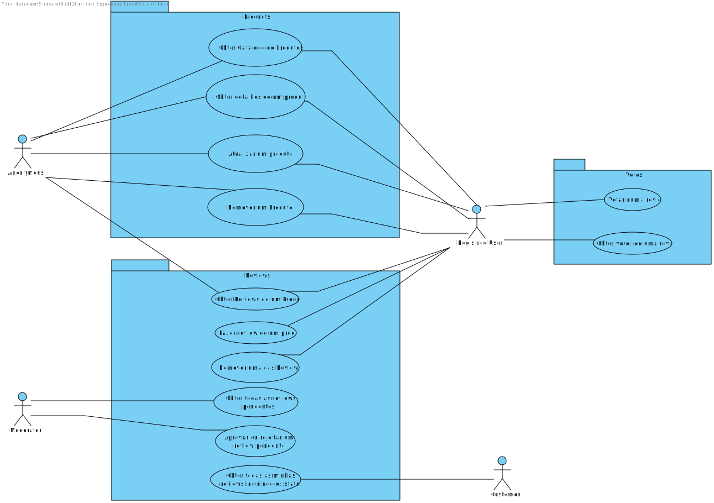

## Vista lógica

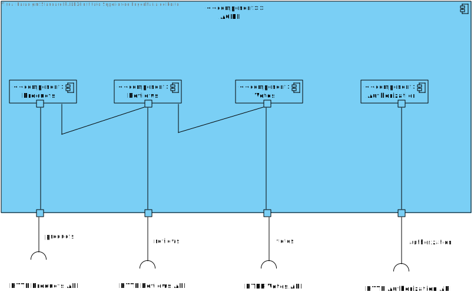

## Vista lógica (Nivel 2)

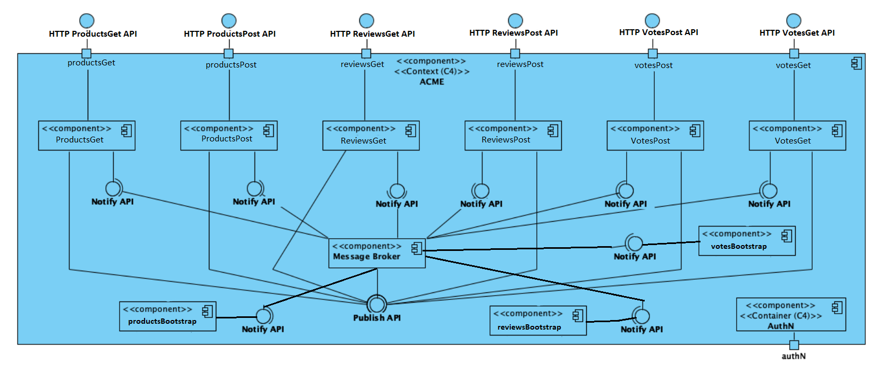

## Vista física

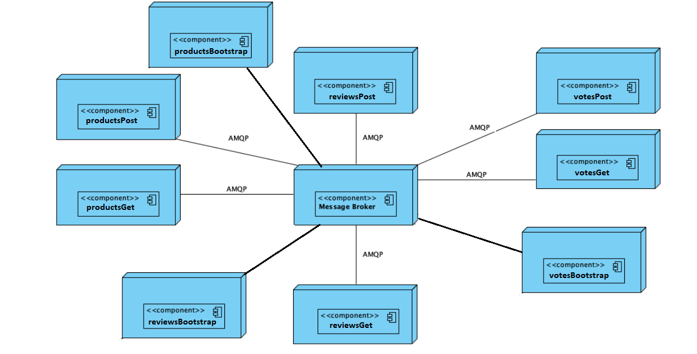

## Diagramas Sequência

### Produto

#### Criar um produto

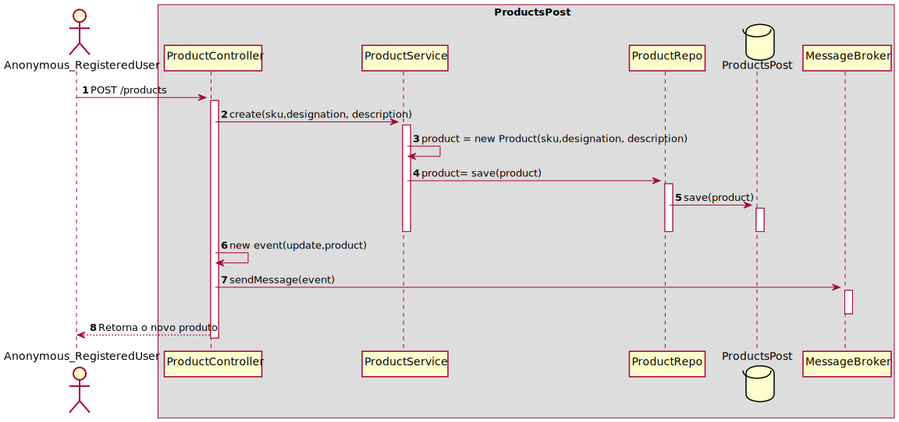

#### Atualizar um produto

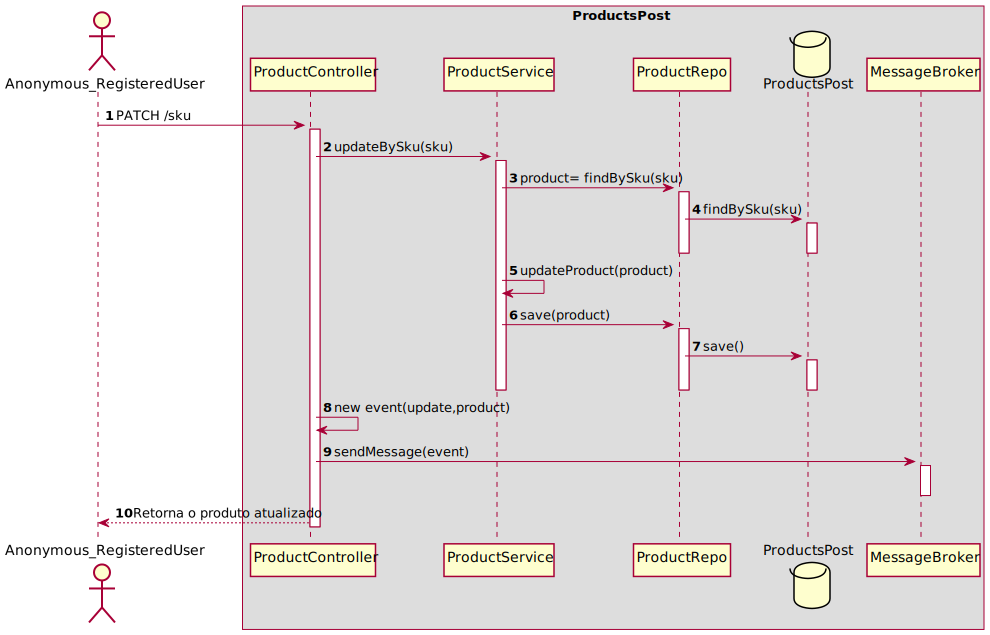

#### Remover um produto

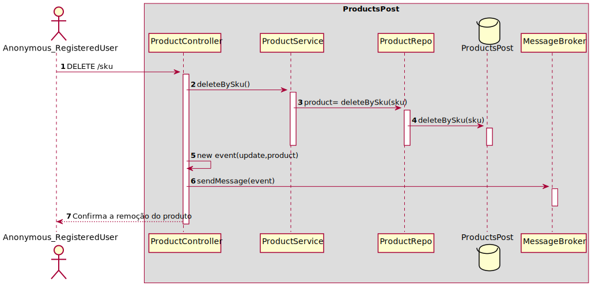

#### Obter catálogo de produtos

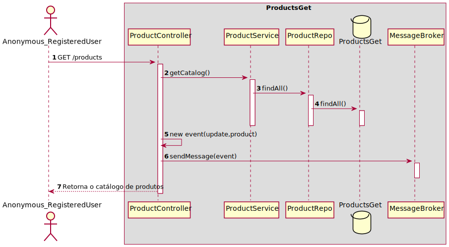

#### Obter detalhes de um produto

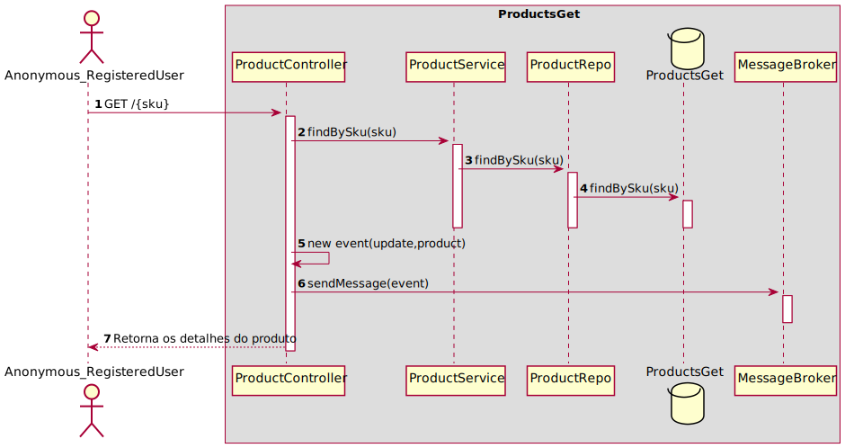

#### Obter reviews do produto

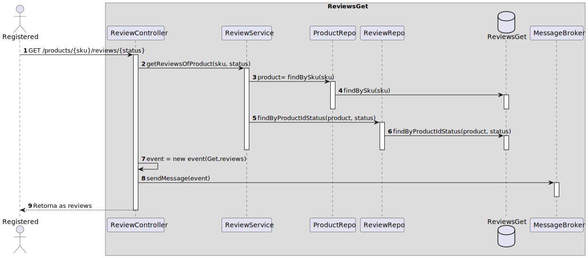

#### Fazer review a um produto

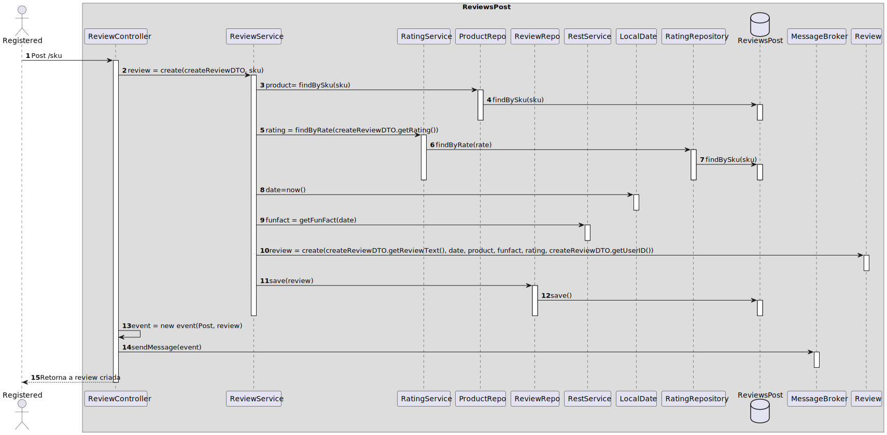

#### Remover Review

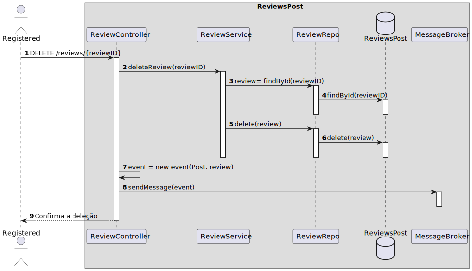

#### Obter Reviews pendentes de um produto

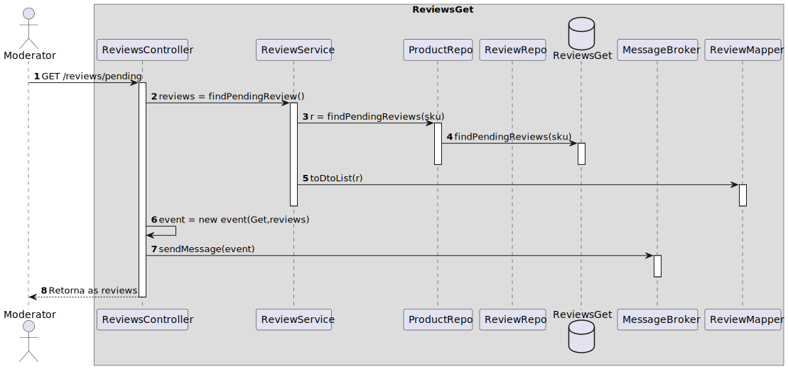

#### Aprovar ou rejeitar review

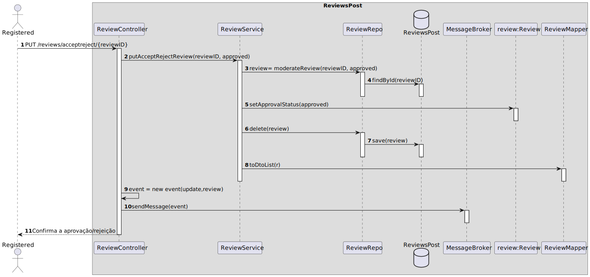

#### Obter todas as reviews incluindo os status

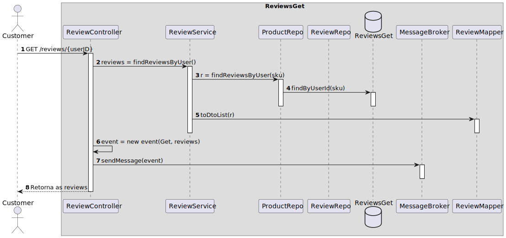

#### Criar um Voto de uma Review

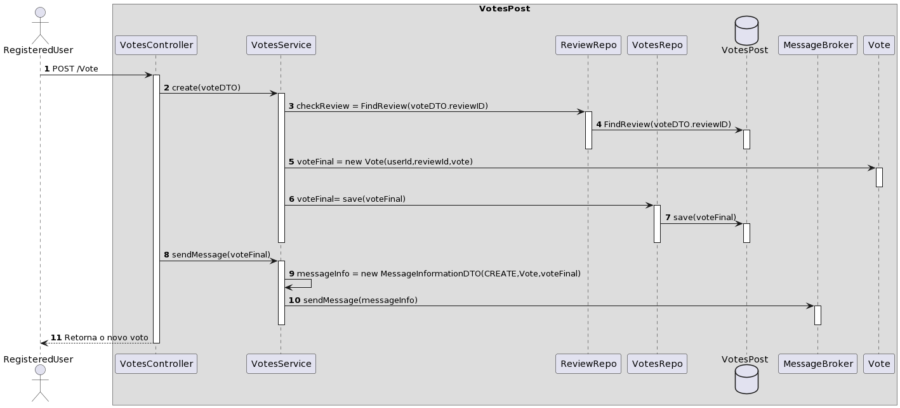

#### Obter todos os votos de uma Review

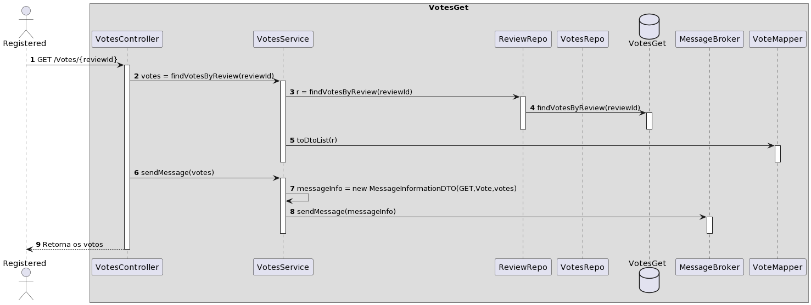

